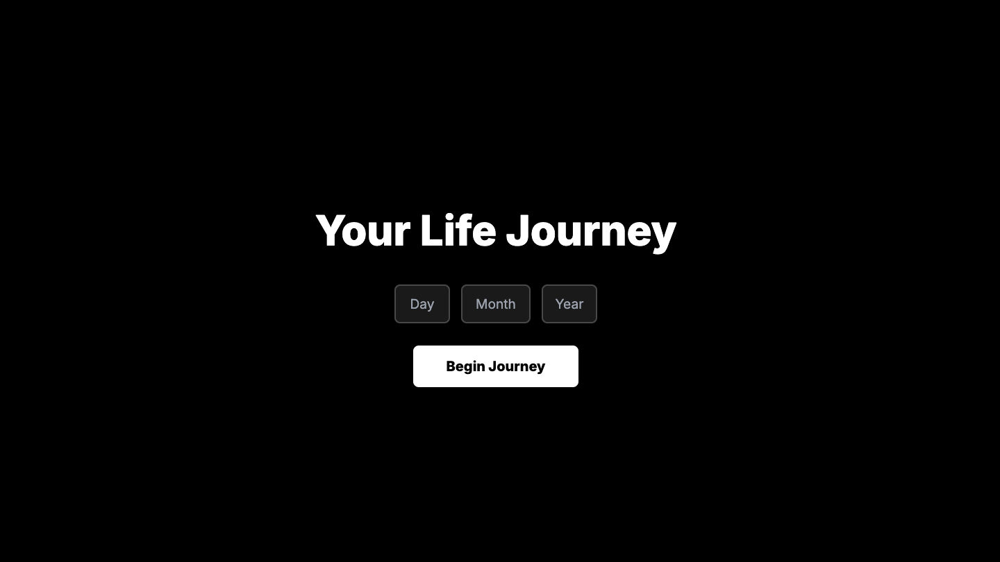

# Life Stats 🌟

A beautiful, interactive web experience that visualizes your life journey through fascinating statistics. Simply enter your birth date and explore various metrics about your life and how the world has changed since you were born.

[Try it live!](https://mohdyahyamahmodi.github.io/life-stats/)



## Features 🚀

- **Personal Statistics:**
  - Heartbeats and blood pumped
  - Red blood cells produced
  - Breaths taken
  - Blinks made
  - Days spent sleeping
  - Saliva produced

- **Cosmic Journey:**
  - Distance traveled around the Sun
  - Distance traveled through the Milky Way
  - Moon orbits witnessed
  - Moon's drift away from Earth

- **World Changes:**
  - Population growth
  - CO2 level changes
  - Currency inflation
  - S&P 500 growth
  - Global improvements in literacy, poverty reduction, and life expectancy

## Technical Details 🔧

- Pure HTML/CSS/JavaScript implementation
- No backend required
- Responsive design using Tailwind CSS
- Smooth scroll-snap navigation
- GSAP animations
- Inter font for modern typography

## Setup 🛠

1. Clone the repository:
```bash
git clone https://github.com/MohdYahyaMahmodi/life-stats.git
```

2. Navigate to the project directory:
```bash
cd life-stats
```

3. Open `index.html` in your browser or use a local server:
```bash
# Using Python 3
python -m http.server 8000

# Using Node.js http-server
npx http-server
```

## Contributing 🤝

Contributions are welcome! Here are some ways you can contribute:

1. **Add New Statistics:**
   - Add new interesting life metrics in the HTML
   - Update the JavaScript calculations
   - Add corresponding visuals

2. **Improve Visualizations:**
   - Enhance existing animations
   - Add new visual elements
   - Improve mobile responsiveness

3. **Optimize Performance:**
   - Improve calculation efficiency
   - Enhance scroll performance
   - Optimize assets

4. **Fix Bugs:**
   - Check for calculation accuracy
   - Test edge cases
   - Improve browser compatibility

### Contribution Steps:

1. Fork the repository
2. Create a feature branch (`git checkout -b feature/YourFeature`)
3. Commit your changes (`git commit -m 'Add some feature'`)
4. Push to the branch (`git push origin feature/YourFeature`)
5. Open a Pull Request

### Development Guidelines:

- Maintain the existing code style
- Test changes across different browsers
- Ensure mobile responsiveness
- Keep calculations accurate
- Document any new features or changes
- Add appropriate comments for complex logic

## Project Structure 📁

```
life-stats/
├── index.html      # Main application file
├── images/         # Images and icons
│   ├── heart.gif
│   ├── breathing.png
│   ├── blinking.gif
│   └── ...
└── README.md       # Project documentation
```

## Credits 👏

- Icons and images: Various free resources
- Fonts: Inter from Google Fonts
- Animation libraries: GSAP
- CSS Framework: Tailwind CSS

## License 📄

This project is open source and available under the [MIT License](LICENSE).

## Support 💖

If you like this project, please give it a ⭐️ on GitHub!

For any questions or suggestions, feel free to:
- Open an issue
- Submit a pull request
- Contact the maintainer

## Easter Egg 🥚

There might be a hidden surprise for someone special... Try different birthdays to find out! 😉
